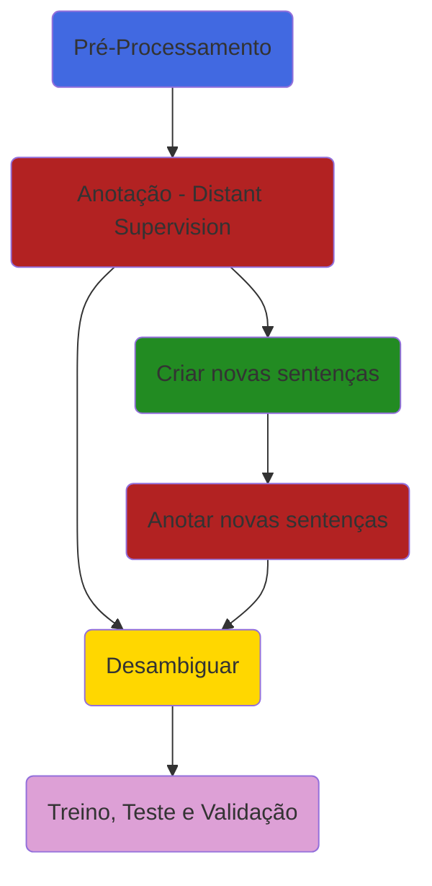
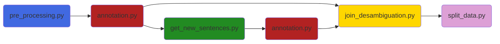
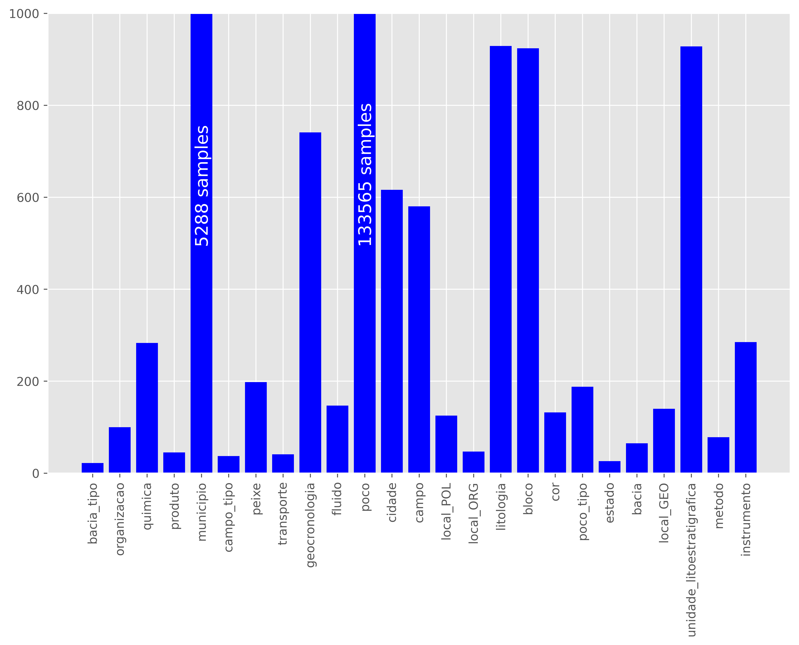
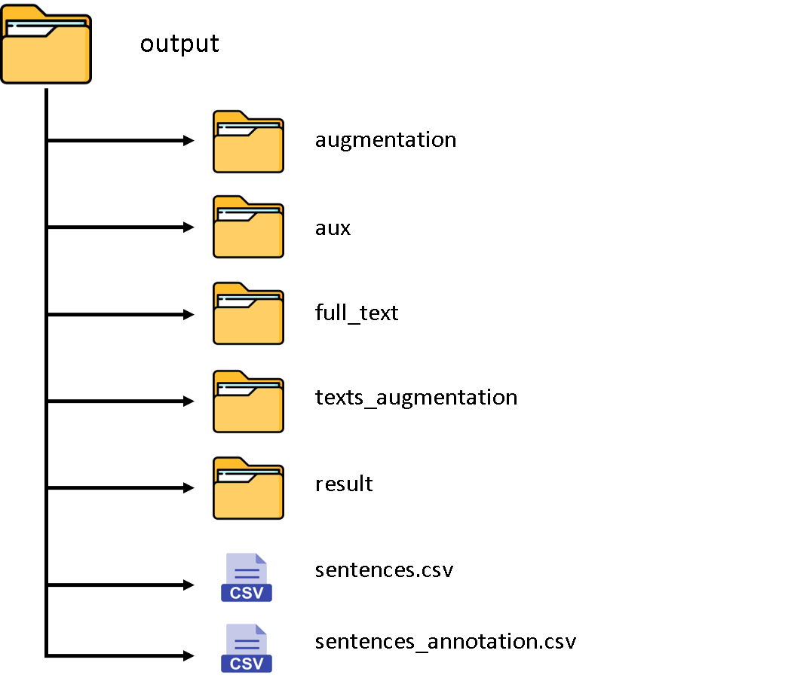
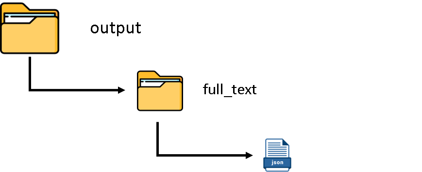
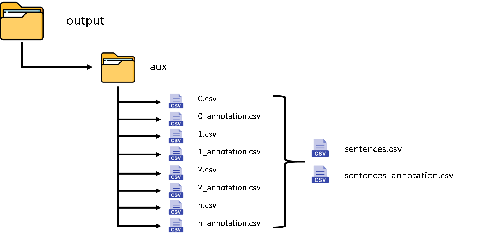
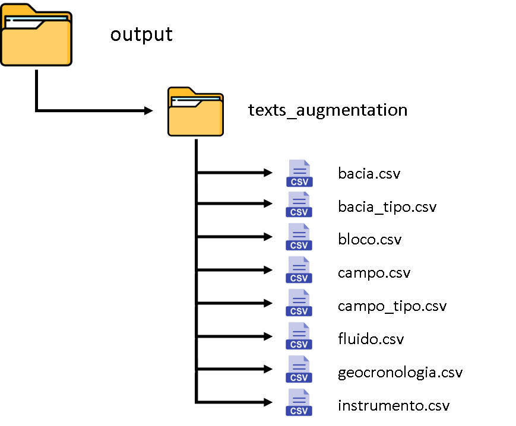
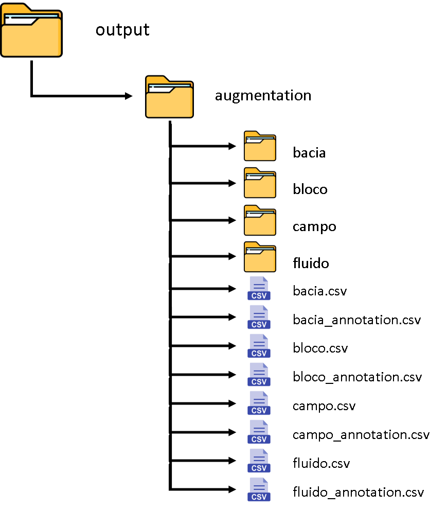
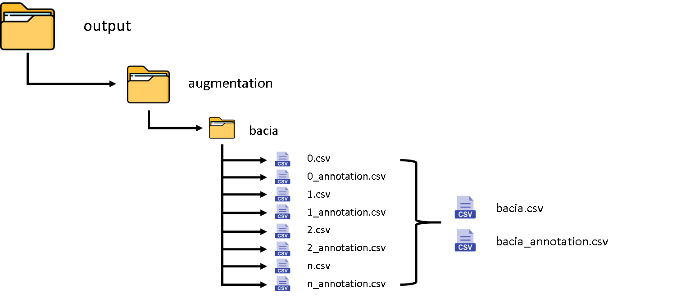
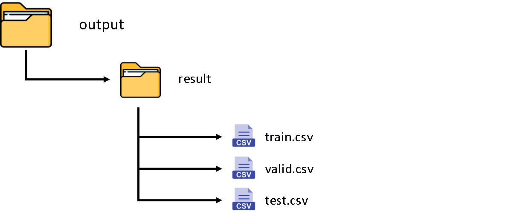

# Named Entity Recognition Dataset

## Observação
Para visualizar os diagramas presentes neste Readme instale a seguinte extensão **GitHub + Mermaid** no seu navegador:
 - **Google Chrome**: https://chrome.google.com/webstore/detail/github-+-mermaid/goiiopgdnkogdbjmncgedmgpoajilohe
 - **Firefoz**: https://addons.mozilla.org/pt-BR/firefox/addon/github-mermaid/

## Descrição do Projeto
Este repositório tem a função de aprensentar uma metodologia e as ferramentas para a criação de um banco de dados para o treinamento de uma rede neural para a tarefa de reconhecimento de entidades nomeadas (NER) utilizando para tal a técnica de **distant siupervision**. Uma visão geral da metodologia para a criação da base de dados pode ser obsvervada na figura abaixo.

- **Sequênciamento de scrips**

## Descrição do fluxo do projeto

 - **Pré-Processamento** Nesta etapa o texto contidos em todos os documentos .txt encontrados nas pastas dadas como entrada são lidos e sofrem uma limpeza.
   1. Remoção de caracteres especiais
   2. Separação da pontuação do texto (exemplo: teste: --> teste :) 
   3. O pré-processamento realizado realiza tranformações e limpezas de tal forma que as sentenças sejam semelhantes, em termos de formatação, às sentenças encontradas no **geocorpus** (uma espécie de dataset GOLDEN para a aplicação NER no domínio de Óle & Gás). Geocurpus está disponível em: https://github.com/jneto04/geocorpus
 
 - **Anotação:** Consiste me anotar as sentenças automaticamente no formato BIO, explicado anteriormente, utilizando a técnica de **distant supervison**. Utilizando como fonde de dados externos um conjunto de documentos relacionados ao domínio específico e listas de entidades.

#### Lista de estidades
As listas de entidades são formadas por palavras ou expressões relacionadas a uma classe de interesse no domínio de Óleo & Gás. A figura abaixo mostra a quantidade de palavras / termos relacionados de cada classe. Essaa foram fornecidas por especialistas da área.

 - **Aumento da base de dados:** esse passo não é obrigatório. Mas caso seja necessário criar mais dados utilizando a técnica de substituição de palavras / termos relacionados a cada classe para aumentar a quantidade de amostras e apliar o vocabulário com todas as palavras / termos relacionados conhecidos.
   1. **Criar novas sentenças:** Seleciona as sentenças  com uma classe específica e faz a substituição simples das palavras por uma regra de substituição e definição da quantidade de novas sentenças que serão criadas. 
   2. **Anotar novas sentenças:** Realiza o processo de anotação automática nas novas sentenças criadas. 
 - **Desambiguar:** Essa etapa ocorre da seguinte forma:
   1. Inicialmente selecionamos as sentenças anotadas inicialmente com o texto original e aplicamos o processo de desambiguação de dados (é criada uma nova coluna na tabela com a identifficação da sentença).
   2. Após isso, criamos o novo label de anotação unindo todas as classes, apenas para os casos onde não há ambiguidade ente as sentenças evitando multiplas anotações para um mesmo token.
   3. Identificamos amostras positivas e negativas.
   4. Salvamos o arquivo com as modificações sofridas.
   5. Os procedimentos acima citados são feitos para as sentenças modificadas anotadas no data augmentation (arquivos .csv dentro da pasta **augmentation**) 

 - **Treino, Teste e Validação:** Existem duas possibilidades de separação para o dataset
   1. Separação de treino + validação e teste por meio da sentença original.
   2. Separação de treino + validação e teste por meio do documento de origem da sentença.

O formato final e o tipo de anotação é descrito a seguir.

#### Dataset 
Os datasets de treinamento, validação e test são formado por sentenças cujos labels então no formato IOB. O formato IOB (abreviação de dentro, fora, início) é um formato de marcação comum para tokens de marcação em uma tarefa de agrupamento em linguística computacional (por exemplo , reconhecimento de entidade nomeada ). Ele foi apresentado por Ramshaw e Marcus em seu artigo "Text Chunking using Transformation-Based Learning", 1995.

-   _B_: é uma tag que indica o início de um trecho de texto que representa a entidade de interesse.
-   _I_: é uma tag que indica que a o token está dentro de um trecho de texto que representa a entidade de interesse.
-   _O_: é uma tag indica que um token não pertence a entidade de interece.

Para a meotodolia proposta neste projeto a composição do dataset é baseada na técnica de distant supervision utilizando para tal listas de palavras relacionadas a cada entidade de interesse (da organização ou pessoa que for utilizar essa metodologia).

Também foram utilizadas técnicas para aumentar a quantidade de dados de treinamento da base de dados utilizando o máximo de palavras ou trechos de texto que representem as entidades de interesse presentes nas listas fornecidas já fornecidas.

O formato final consistem em um .csv com os tokens e labels respectivos. Um exmeplo pode ser observado abaixo:

||0|	1	|sentence|
|--|--|-----|--|
|0|	as|	O	|72543|
|1|	facilidades	|O|	72543|
|2|	levaram	|O|	72543|
|3|	ao	|O|	72543|
|4|	uso	|O|	72543|
|5|	desenfreado	|O|	72543|
|6|	do	|O|	72543|
|7|	recurso	|O|	72543|
|8|	e	|O|	|72543|
|9|	segundo	|O	|72543|
|10|	os	|O|	72543|
|11|	catadores	|O|	72543|
|12|	isso	|O|	72543|
|13|	diminuiu	|O|	72543|
|14|	o	|O|	72543|
|15|	numero	|O|	72543|
|16|	de	|O|	72543|
|17|	7et0550rn	|B|	72543|
|18|	.	|O|	72543|
|21|	foi	|O|	48925|
|22|	descoberto	|O|	48925|
|23|	pelo	|O|	48925|
|24|	poco	|O|	48925|
|25|	3-brsa-1295-rn	|B|	48925|
|26|	em	|O|	48925|
|27|	agosto	|O|	48925|

 
## Output 

- **Pastas e arquivos de saída:**

A pasta final contendo as saídas após todo o passo a passo contém a estrutura definida pela imagem abaixo:

O conteúdo de cada pasta é detalhado a seguir:

1. **full_text**: Nesta pasta será salvo um arquivo full_text.json com o texto pré-processado e seu respectivo documento de origem.

2. **aux**: É uma pasta auxiliar criada no caso de sub-dividir o processo de anotação dos dados em sub-processos (**num_of_chuncks diferente de 1**), desde que **não seja** para o processo de **data augmentation** (para o data augmentation é criada uma pasta própria). Neste caso ao realizar o processo de criação de novas sentenças, caso o processo de anotação inicial tenha sido sub-dividido em sub-processos será realizada a junção desses arquivos para formar os arquivos sentences.csv e sentences_annotation.csv que são necessários para criar novas sentenças.

3. **texts_augmentation**: Quando se cria novas sentenças durante o processo de **data augmentation** as novas sentenças com suas respectivas informações relevantes são salvas nesta pasta, sendo um arquivo .csv para cada tipo de entidade (é possível criar novas sentenças levando em conta uma classe específica se for necessário). O .csv contém a sentença modificada, a sentença original e o documento de origem).

4. **augmentation**: Nesta pasta são salvos os arquivos anotados para as sentenças modificadas no processo de **data augmentation**, separadas por classe, visto que podemos aumentar a quantidade de sentenças para classes específicas e obter grandes conjuntos de dados (na casa de GB de informação). O conteúdo da pasta é exemplificado na imagem abaixo:

Vale salientar que essa pasta pode ter sub-pastas, caso haja a necessidade de se subdividir os processos de anotação para pelo menos uma das classe (uma forma de aproveitar máquinas disponíveis caso seja necessário reduzir o tempo de criação da base de dados e aproveitar os recussos computacionais). A subpasta é organizada da seguinte forma, tendo como nome o nome da classe:

5. **result**: Após anottar as novas sentenças, temos que organizar os dados obtidos, realizar o processo de desambiguação de dados e selecionar as sentenças para treino, teste e validação. A pasta result recebe a versão final do dataset para treinamento do modelo no formato final. 

